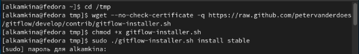
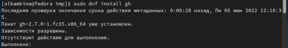
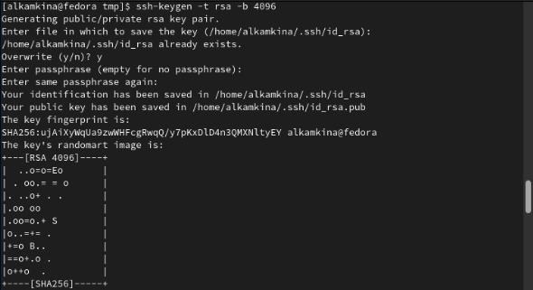
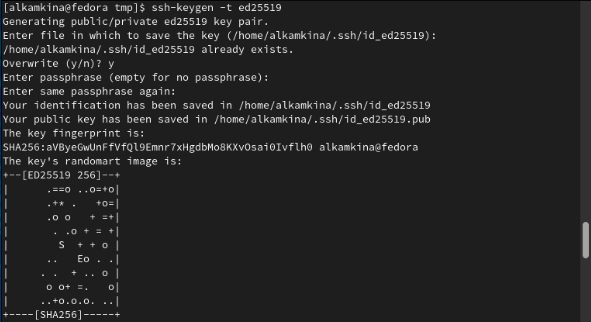
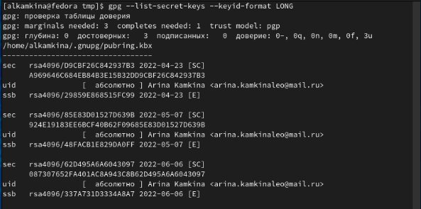
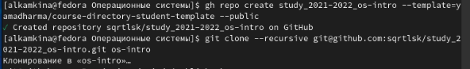
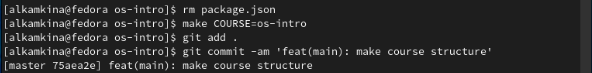
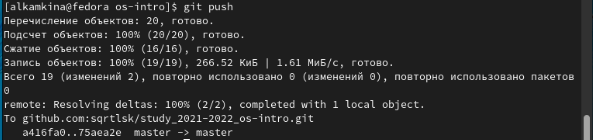

---
## Front matter
title: "Лабораторная работа №2"
subtitle: "Управление версиями"
author: "Камкина Арина Леонидовна"

## Generic otions
lang: ru-RU
toc-title: "Содержание"

## Bibliography
bibliography: bib/cite.bib
csl: pandoc/csl/gost-r-7-0-5-2008-numeric.csl

## Pdf output format
toc: true # Table of contents
toc-depth: 2
lof: true # List of figures
lot: true # List of tables
fontsize: 12pt
linestretch: 1.5
papersize: a4
documentclass: scrreprt
## I18n polyglossia
polyglossia-lang:
  name: russian
  options:
	- spelling=modern
	- babelshorthands=true
polyglossia-otherlangs:
  name: english
## I18n babel
babel-lang: russian
babel-otherlangs: english
## Fonts
mainfont: PT Serif
romanfont: PT Serif
sansfont: PT Sans
monofont: PT Mono
mainfontoptions: Ligatures=TeX
romanfontoptions: Ligatures=TeX
sansfontoptions: Ligatures=TeX,Scale=MatchLowercase
monofontoptions: Scale=MatchLowercase,Scale=0.9
## Biblatex
biblatex: true
biblio-style: "gost-numeric"
biblatexoptions:
  - parentracker=true
  - backend=biber
  - hyperref=auto
  - language=auto
  - autolang=other*
  - citestyle=gost-numeric
## Pandoc-crossref LaTeX customization
figureTitle: "Рис."
tableTitle: "Таблица"
listingTitle: "Листинг"
lofTitle: "Список иллюстраций"
lotTitle: "Список таблиц"
lolTitle: "Листинги"
## Misc options
indent: true
header-includes:
  - \usepackage{indentfirst}
  - \usepackage{float} # keep figures where there are in the text
  - \floatplacement{figure}{H} # keep figures where there are in the text
---

# Цель работы

- Изучить идеологию и применение средств контроля версий.
- Освоить умения по работе с git.

# Задание

- Создать базовую конфигурацию для работы с git.
- Создать ключ SSH.
- Создать ключ PGP.
- Настроить подписи git.
- Зарегистрироваться на Github.
- Создать локальный каталог для выполнения заданий по предмету.

# Теоретическое введение
## Основные команды git
Наиболее часто используемые команды git:
- создание основного дерева репозитория:
> git init
- получение обновлений (изменений) текущего дерева из центрального репозитория:
> git pull
- отправка всех произведённых изменений локального дерева в центральный репозиторий:
> git push
- просмотр списка изменённых файлов в текущей директории:
> git status
- просмотр текущих изменения:
> git diff
- сохранение текущих изменений:
- добавить все изменённые и/или созданные файлы и/или каталоги:
> git add .
- добавить конкретные изменённые и/или созданные файлы и/или каталоги:
> git add имена_файлов
- удалить файл и/или каталог из индекса репозитория (при этом файл и/или каталог
остаётся в локальной директории):
> git rm имена_файлов
- сохранение добавленных изменений:
- сохранить все добавленные изменения и все изменённые файлы:
> git commit -am 'Описание коммита'
- сохранить добавленные изменения с внесением комментария через встроенный
редактор:
> git commit
- создание новой ветки, базирующейся на текущей:
> git checkout -b имя_ветки
- переключение на некоторую ветку:
> git checkout имя_ветки
(при переключении на ветку, которой ещё нет в локальном репозитории, она будет
создана и связана с удалённой)
- отправка изменений конкретной ветки в центральный репозиторий:
> git push origin имя_ветки
- слияние ветки с текущим деревом:
> git merge --no-ff имя_ветки
- удаление ветки:
- удаление локальной уже слитой с основным деревом ветки:
> git branch -d имя_ветки
- принудительное удаление локальной ветки:
> git branch -D имя_ветки
- удаление ветки с центрального репозитория:
> git push origin :имя_ветки

# Выполнение лабораторной работы

1. Для начала создала йчетную запичь на github и заполнила основные данные.

2. Установила git-flow в Fedora Linux (рис. [-@fig:001])

{ #fig:001 width=70% }

3. Установила gh в Fedora Linux (рис. [-@fig:002])

{ #fig:002 width=70% }

4. Произвела базовую настройку git (рис. [-@fig:003])

{ #fig:003 width=70% }

5. Произвела базовую настройку git (рис. [-@fig:004] [-@fig:005])

{ #fig:004 width=70% }

{ #fig:004 width=70% }

6. Создала ключ pgp и добавила его в github (рис. [-@fig:006])

{ #fig:007 width=70% }

7. Добавила его в github и настроила автоматические подписи коммитов git и авторизовалась (рис. [-@fig:007])

{ #fig:007 width=70% }

8. Создала каталог и затем перешла в него (рис. [-@fig:008])

{ #fig:008 width=70% }

9. Создала репозиторий на основе шаблона (рис. [-@fig:009])

{ #fig:009 width=70% }

10. Настроила каалог курса и отправила нужные файлы на сервер (рис. [-@fig:0010] [-@fig:0011)

{ #fig:0010 width=70% }

{ #fig:0011 width=70% }

# Выводы

Освоила работу с git и получила знания о некоторых его функциях.

# Контрольные вопросы

1. Системы контроля версий (Version Control System, VCS) применяются при работе нескольких человек над одним проектом. Системы контроля версий поддерживают возможность отслеживания и разрешения
конфликтов, которые могут возникнуть при работе нескольких человек над одним файлом. Можно объединить (слить) изменения, сделанные разными участниками (автоматически или вручную), вручную выбрать нужную версию, отменить изменения вовсе или заблокировать файлы для изменения. В зависимости от настроек блокировка не позволяет другим пользователям получить рабочую копию или препятствует изменению рабочей копии файла средствами файловой системы ОС, обеспечивая таким образом, привилегированный доступ только одному пользователю, работающему с файлом.
2. 
- Хранилище - централизованная модель,
предполагающая наличие единого репозитория для хранения файлов. Выполнение большинства функций по управлению версиями осуществляется специальным сервером. Участник проекта (пользователь) перед началом работы посредством определённых
команд получает нужную ему версию файлов
- Сommit - команда для записи индексированных изменений в репозиторий.
- История - место, где сохраняются все коммиты, по которым можно посмотреть данные о коммитах.
- Рабочая копия - текущее состояние  файлов пректа основанное на версии, загруженной из хранилища.
3. 
- Централизованные системы – это системы, в которых одно основное хранилище всего проекта, и каждый пользователь копирует необходимые ему файлы, изменяет и вставляет обратно. Пример – Subversion.
- Децентрализованные системы – система, в которой каждый пользователь имеет свой вариант репозитория и есть возможность добавлять и забирать изменения из репозиториев. Пример – Git.
4. В рабочей копии, которую исправляет человек, появляются правки, которые отправляются в хранилище на каждом из этапов. То есть в правки в рабочей копии появляются, только если человек делает их.
5. Если хранилище общее, то в рабочую копию каждого, кто работает над проектом, приходят изменения, отправленные на сервер одним из команды. Рабочая правка каждого может изменяться вне зависимости от того, делает ли конкретный человек правки или нет.
6. У Git две основных задачи: первая — хранить информацию обо всех изменениях в вашем коде, начиная с самой первой строчки, а вторая — обеспечение удобства командной работы над кодом.
7. 
- создание основного дерева репозитория:
> git init
- получение обновлений (изменений) текущего дерева из центрального репозитория:
> git pull
- отправка всех произведённых изменений локального дерева в центральный репозиторий:
> git push
- просмотр списка изменённых файлов в текущей директории:
> git status
- просмотр текущих изменения:
> git diff
- сохранение текущих изменений:
- добавить все изменённые и/или созданные файлы и/или каталоги:
> git add .
- добавить конкретные изменённые и/или созданные файлы и/или каталоги:
> git add имена_файлов
- удалить файл и/или каталог из индекса репозитория (при этом файл и/или каталог
остаётся в локальной директории):
> git rm имена_файлов
- сохранение добавленных изменений:
- сохранить все добавленные изменения и все изменённые файлы:
> git commit -am 'Описание коммита'
- сохранить добавленные изменения с внесением комментария через встроенный
редактор:
> git commit
- создание новой ветки, базирующейся на текущей:
> git checkout -b имя_ветки
- переключение на некоторую ветку:
> git checkout имя_ветки
(при переключении на ветку, которой ещё нет в локальном репозитории, она будет
создана и связана с удалённой)
- отправка изменений конкретной ветки в центральный репозиторий:
> git push origin имя_ветки
- слияние ветки с текущим деревом:
> git merge --no-ff имя_ветки
- удаление ветки:
- удаление локальной уже слитой с основным деревом ветки:
> git branch -d имя_ветки
- принудительное удаление локальной ветки:
> git branch -D имя_ветки
- удаление ветки с центрального репозитория:
> git push origin :имя_ветки
8. 
- Работа с удаленным репозиторием: git remote – просмотр списка настроенных удаленных репозиториев.
- Работа с локальным репозиторием: git status - выводит информацию обо всех изменениях, внесенных в дерево директорий проекта по сравнению с последним коммитом рабочей ветки.
9. Ветка — это последовательность коммитов, в которой ведётся параллельная разработка какого-либо функционала. Ветки нужны, чтобы несколько программистов могли вести работу над одним и тем же проектом или даже файлом одновременно, при этом не мешая друг другу. Кроме того, ветки используются для тестирования экспериментальных функций: чтобы не повредить основному проекту, создается новая ветка специально для экспериментов.
10. Игнорируемые файлы — это, как правило, артефакты сборки и файлы, генерируемые машиной из исходных файлов в вашем репозитории, либо файлы, которые по какой-либо иной причине не должны попадать в коммиты. В Git нет специальной команды для указания игнорируемых файлов: вместо этого необходимо вручную отредактировать файл.
- Временно игнорировать изменения в файле можно командой git
> update-index-assumeunchanged
