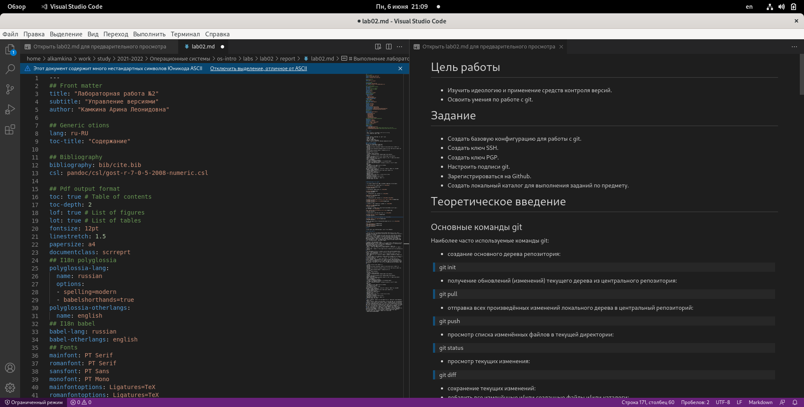

---
## Front matter
title: "Лабораторная работа №3"
subtitle: "Markdown"
author: "Камкина Арина Леонидовна"

## Generic otions
lang: ru-RU
toc-title: "Содержание"

## Bibliography
bibliography: bib/cite.bib
csl: pandoc/csl/gost-r-7-0-5-2008-numeric.csl

## Pdf output format
toc: true # Table of contents
toc-depth: 2
lof: true # List of figures
lot: true # List of tables
fontsize: 12pt
linestretch: 1.5
papersize: a4
documentclass: scrreprt
## I18n polyglossia
polyglossia-lang:
  name: russian
  options:
	- spelling=modern
	- babelshorthands=true
polyglossia-otherlangs:
  name: english
## I18n babel
babel-lang: russian
babel-otherlangs: english
## Fonts
mainfont: PT Serif
romanfont: PT Serif
sansfont: PT Sans
monofont: PT Mono
mainfontoptions: Ligatures=TeX
romanfontoptions: Ligatures=TeX
sansfontoptions: Ligatures=TeX,Scale=MatchLowercase
monofontoptions: Scale=MatchLowercase,Scale=0.9
## Biblatex
biblatex: true
biblio-style: "gost-numeric"
biblatexoptions:
  - parentracker=true
  - backend=biber
  - hyperref=auto
  - language=auto
  - autolang=other*
  - citestyle=gost-numeric
## Pandoc-crossref LaTeX customization
figureTitle: "Рис."
tableTitle: "Таблица"
listingTitle: "Листинг"
lofTitle: "Список иллюстраций"
lotTitle: "Список таблиц"
lolTitle: "Листинги"
## Misc options
indent: true
header-includes:
  - \usepackage{indentfirst}
  - \usepackage{float} # keep figures where there are in the text
  - \floatplacement{figure}{H} # keep figures where there are in the text
---

# Цель работы

Научиться оформлять отчёты с помощью легковесного языка разметки Markdown.

# Задание

- Сделать отчёт по предыдущей лабораторной работе в формате Markdown.
- В качестве отчёта просьба предоставить отчёты в 3 форматах: pdf, docx и md (в архиве, поскольку он должен содержать скриншоты, Makefile и т.д.)

# Предварительные сведения
## Базовые сведения о Markdown

- Чтобы создать заголовок, используйте знак ( # ), например:
 > # This is heading 1
 > ## This is heading 2
 > ### This is heading 3
 > #### This is heading 4

- Чтобы задать для текста полужирное начертание, заключите его в двойные звездочки:
> This text is **bold**.
- Чтобы задать для текста курсивное начертание, заключите его в одинарные звездочки:
> This text is *italic*.
- Чтобы задать для текста полужирное и курсивное начертание, заключите его в тройные
звездочки:
> This is text is both ***bold and italic***.
- Блоки цитирования создаются с помощью символа >:
> > Helo World!

- Неупорядоченный (маркированный) список можно отформатировать с помощью звездочек или тире:
> - List item 1
> - List item 2

-Чтобы вложить один список в другой, добавьте отступ для элементов дочернего списка:

> - List item 1
> - - List item A
> - - List item B

- Упорядоченный список можно отформатировать с помощью соответствующих цифр:
> 1. First instruction
> 2. Second instruction

- Синтаксис Markdown для встроенной ссылки состоит из части [link text] , представляющей текст гиперссылки, и части (file-name.md) – URL-адреса или имени файла, на который дается ссылка:
> [link text](file-name.md)

# Выполнение лабораторной работы

1. Для начала создала установила Visual Studio Code на Linux Fedora и pandoc, который понадобиться, чтобы поменять расширение.

Так выглядит окно VS Code с Markdown, cлева - окно, в которм я работаю, справа - окно, чтобы смотреть, что в итоге выходит. (рис. [-@fig:001])

{ #fig:001 width=70% }

2. Введение данных в титульный лист (рис. [-@fig:002])

{ #fig:002 width=70% }

3. Написала цели и задания, использу я знаки "-" для списка (рис. [-@fig:003])

{ #fig:003 width=70% }

4. Написала теоретическое введение используя два вида #Head (рис. [-@fig:004])

{ #fig:004 width=70% }

5. Описала ход работы и вставила картинки (рис. [-@fig:005])

{ #fig:005 width=70% }

6. Написала вывод и ответила на контрольные вопросы (рис. [-@fig:006])

{ #fig:006 width=70% }

# Выводы

Я научилась оформлять отчёты и презентации с помощью легковесного языка разметки Markdown и менять расширение с md на docx и pdf.

